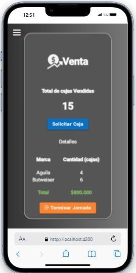
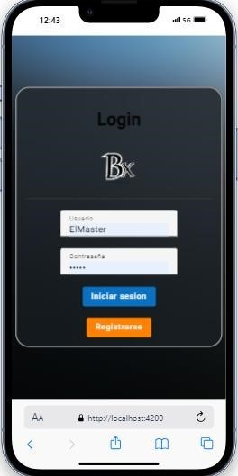
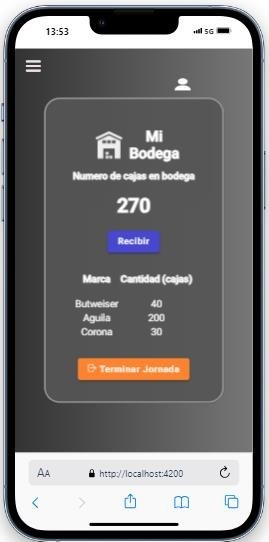

# BodegaX

 # 1. **Introducción**  

 **Bodega X** es una aplicación web diseñada para optimizar la gestión y logística de bodegas de cervezas, asegurando un control eficiente en cada etapa del proceso, desde el almacenamiento hasta la entrega final al cliente.  


---
<details>
<summary> 🚀 1.1. Bodega X: Optimización y Control en la Logística de Bodegas  </summary>


Esta plataforma permite a las bodegas administrar sus ventas, gestionar inventarios y hacer un seguimiento detallado de los pedidos en tiempo real. Con módulos específicos para administradores y usuarios, **Bodega X** ofrece una experiencia intuitiva y adaptable a las necesidades del sector, garantizando transparencia y eficiencia en la distribución.  

</details> 

<details>
<summary>📈 1.2 Beneficios Clave</summary>

- **Optimización del Inventario**: Control en tiempo real de stock y productos.  
- **Automatización de Ventas**: Creación y gestión eficiente de pedidos.  
- **Historial y Reportes**: Análisis detallado de transacciones y movimientos.  
- **Gestión de Usuarios**: Roles y permisos para un acceso seguro y eficiente.  

</details>  


---


# 2. Situación Actual 

**Bodega X** ha sido completada al **100%** y está lista para su implementación en bodegas de cervezas. La aplicación cumple con todas las funcionalidades previstas para la gestión y logística de bodegas, garantizando un control eficiente de los pedidos, ventas e inventario.  

<details>
<summary>✅ 2.1 Componentes de la Plataforma</summary>

- **Frontend en Angular**: Interfaz intuitiva y responsive para la gestión de bodegas.  
- **Backend en Spring Boot**: API robusta y segura para la administración de datos.  
- **Base de datos en PostgreSQL**: Almacenamiento eficiente y estructurado de la información.  

</details>

<details>
<summary>📌 2.2 Módulos Completos</summary>

- **Gestión de ventas y pedidos**.  
- **Administración de inventario**.  
- **Historial de transacciones**.  
- **Configuraciones avanzadas**.  

</details>

<details>
<summary>🚀2.3 Próximos Pasos</summary>

- **Implementación y despliegue** en servidores de producción.  
- **Monitoreo y pruebas** en entornos reales.  
- **Optimización y mantenimiento** según el uso en producción.  

</details>

 

---  

 # 3. Situación Esperada 
<details>
  
Tras su implementación, **Bodega X** se espera que se convierta en una solución clave para la gestión eficiente de bodegas de cervezas, optimizando los procesos de almacenamiento, ventas y distribución.  


<summary>✅3.1  Beneficios Esperados</summary>

- **Mejore la eficiencia operativa**, reduciendo tiempos de gestión y optimizando el control del inventario.  
- **Automatice y agilice los pedidos**, permitiendo un flujo de trabajo más dinámico y reduciendo errores manuales.  
- **Asegure trazabilidad y transparencia**, con un historial detallado de ventas, pedidos y movimientos de stock.  
- **Facilite la toma de decisiones estratégicas**, gracias a reportes y análisis basados en datos en tiempo real.  
- **Garantice escalabilidad y estabilidad**, permitiendo futuras actualizaciones y mejoras sin afectar la operatividad.  

</details>

<details>
<summary>📌3.2  Próximos Desafíos</summary>

- Implementar mejoras basadas en el feedback de los usuarios.  
- Evaluar la integración con sistemas externos de facturación y logística.  
- Optimizar aún más el rendimiento para soportar un mayor volumen de datos y usuarios.  

</details>


---  

#  4. Justificación 

El desarrollo de **Bodega X** surge como una solución integral para optimizar la gestión de bodegas de cervezas, abordando los desafíos comunes en el almacenamiento, control de inventario y logística de distribución.  

<details>
<summary>🛑 4.1 Problemática Identificada</summary>

- **Gestión manual ineficiente**: Muchas bodegas aún dependen de registros físicos o sistemas desactualizados, lo que genera errores y pérdida de información.  
- **Falta de visibilidad en los procesos**: No existe un control centralizado de pedidos, ventas e inventario, dificultando la toma de decisiones.  
- **Demoras en la logística**: La falta de automatización retrasa la entrega de pedidos y afecta la satisfacción del cliente.  
- **Dificultad en el análisis de datos**: Sin herramientas adecuadas, es complicado extraer información clave para optimizar la operación.  

</details>

<details>
<summary>✅ 4.2 Razón de ser </summary>

- **Automatización de procesos**: Digitaliza y agiliza la gestión de ventas, pedidos e inventario.  
- **Optimización del control logístico**: Proporciona información en tiempo real sobre el estado de los productos y pedidos.  
- **Mejora en la toma de decisiones**: Gracias a reportes detallados, permite analizar tendencias y optimizar estrategias comerciales.  
- **Escalabilidad y adaptabilidad**: Diseñada para crecer junto con las necesidades de la bodega, permitiendo futuras integraciones.  

</details>

<details>
<summary>🚀 4.3 Impacto Esperado</summary>

- **Reducción de errores** en la gestión de inventarios y pedidos.  
- **Ahorro de tiempo y recursos** en procesos administrativos.  
- **Mayor satisfacción del cliente** gracias a entregas más rápidas y precisas.  
- **Un sistema centralizado y seguro** para la administración de la bodega.  

</details>

Con **Bodega X**, las bodegas podrán mejorar su eficiencia operativa, garantizar un mejor servicio y adaptarse a la transformación digital del sector.  


---  

# 5. **Aspectos Legales**  

El desarrollo e implementación de **Bodega X** debe cumplir con normativas legales que regulan el tratamiento de datos personales, la protección de la información y las operaciones comerciales.  

<details>
  <summary>📜5.1 Normas Aplicables</summary>

  | Norma o Ley | Descripción | Enlace |  
  | --- | --- | --- |  
  | **Ley de Protección de Datos Personales o Ley 1581 de 2012** | Reconoce y protege el derecho que tienen todas las personas a conocer, actualizar y rectificar las informaciones que se hayan recogido sobre ellas en bases de datos o archivos que sean susceptibles de tratamiento por entidades de naturaleza pública o privada. | https://tinyurl.com/2p8k5j9y |  
  | **Reglamento General de Protección de Datos (GDPR) - UE** | Regula la protección de datos personales en la Unión Europea, estableciendo derechos para los usuarios y obligaciones para las empresas que manejen información personal. |https://tinyurl.com/4t6c5j8u | 
  | **Ley 527 de 1999 - Comercio Electrónico (Colombia)** | Regula la validez jurídica de los mensajes de datos y el uso de firmas digitales en transacciones electrónicas. | https://tinyurl.com/ywvnyc9u |  
  | **Ley 962 de 2005 - Simplificación de Trámites** | Busca la optimización de procesos administrativos, promoviendo la digitalización y simplificación en sectores públicos y privados. | https://tinyurl.com/3hpcnux5 |  
  | **Ley 1266 de 2008 - Hábeas Data** | Regula la administración de datos financieros, comerciales y crediticios, garantizando el derecho a la intimidad y el buen nombre de los ciudadanos. | https://tinyurl.com/5by5ykzu |  

</details>

<details>

  <summary>📜 5.2 Importancia del Cumplimiento Legal en Bodega X </summary> 

✅ **Protección de Datos:** Se garantizará el cumplimiento de la Ley 1581 de 2012 y el GDPR para asegurar que los datos personales de los clientes y usuarios sean manejados de forma segura.  
✅ **Validez de Transacciones Electrónicas:** La plataforma se alineará con la Ley 527 de 1999 para garantizar la legalidad de las transacciones digitales.  
✅ **Seguridad y Privacidad:** Se adoptarán medidas para el manejo responsable de datos financieros y comerciales, cumpliendo con la Ley 1266 de 2008.  

Con este marco legal, **Bodega X** operará de manera segura, confiable y conforme a la normativa vigente.  

 </details>

---  

# 6. Especificación de Requisitos  

A continuación, se detallan los requisitos funcionales y no funcionales de **Bodega X**, garantizando que la aplicación cumpla con las necesidades operativas de la gestión de bodegas.  

<details>
  
<summary>💻 6.1 Requisitos Funcionales  </summary> 
  
  

Estos requisitos describen las funcionalidades esenciales que debe cumplir el sistema.  
</details>

<details>

  <summary>👤 6.2 Gestión de Usuarios</summary>

  - Registro, autenticación y autorización de usuarios con roles específicos (administrador, operador, supervisor).  
  - Control de acceso basado en permisos según el perfil del usuario.  

</details>

<details>
  <summary>📦 6.3 Gestión de Inventario</summary>

  - Registro y actualización de productos en la bodega.  
  - Control de stock con alertas de baja existencia.  
  - Historial de movimientos de productos dentro de la bodega.  

</details>

<details>
  <summary>🛒 6.4 Gestión de Ventas y Pedidos</summary>

  - Creación, modificación y cancelación de pedidos.  
  - Generación de facturas y control de pagos.  
  - Seguimiento del estado de cada pedido (pendiente, en proceso, entregado).  

</details>

<details>
  <summary>📊 6.5 Historial y Reportes</summary>

  - Generación de reportes sobre ventas, inventario y clientes.  
  - Exportación de reportes en formatos CSV o PDF.  

</details>

<details>
  <summary>⚙️6.6 Configuraciones del Sistema</summary>

  - Personalización de parámetros operativos según las necesidades de la bodega.  
  - Gestión de impuestos y descuentos en productos.  

</details>


<details>

<summary>📉 6.7 Requisitos No Funcionales</summary>  

Estos requisitos establecen características de calidad y desempeño del sistema.  
</details>
<details>
  <summary>🔒 6.8 Seguridad</summary>

  - Uso de autenticación basada en JWT para proteger las sesiones de usuario.  
  - Cifrado de contraseñas y datos sensibles.  

</details>

<details>
  <summary>🚀 6.9 Escalabilidad y Rendimiento</summary>

  - Arquitectura optimizada para manejar un alto volumen de datos y transacciones.  
  - Backend con Spring Boot y PostgreSQL para garantizar estabilidad y eficiencia.  

</details>

<details>
  <summary>⚡ Disponibilidad y Confiabilidad</summary>

  - Sistema con alta disponibilidad para evitar interrupciones en la operación.  
  - Mecanismos de recuperación para minimizar la pérdida de datos.  

</details>


# 7. Requisitos Funcionales y No Funcionales

<details>
  


<summary>📋  7.1 Requisitos Funcionales </summary>

| FUNCIONALIDAD                                    | TIPO       |
|--------------------------------------------------|------------|
| RF01 - Registro y autenticación de usuarios.    | Esencial   |
| RF02 - Asignación de roles y permisos.          | Esencial   |
| RF03 - Gestión de productos e inventario.       | Esencial   |
| RF04 - Control de stock con alertas automáticas.| Esencial   |
| RF05 - Creación, modificación y cancelación de pedidos. | Esencial   |
| RF06 - Facturación y gestión de pagos.          | Esencial   |
| RF07 - Historial de ventas y pedidos.           | Esencial   |
| RF08 - Generación de reportes en CSV y PDF.     | Ideal      |
| RF09 - Notificaciones en tiempo real.           | Ideal      |
| RF10 - Personalización de la configuración del sistema. | Ideal      |
| RF11 - Integración con sistemas de facturación electrónica. | Opcional   |
| RF12 - Soporte para múltiples bodegas.          | Opcional   |
| RF13 - Modo offline para consulta de datos.     | Opcional   |

</details>

  <details>
<summary>📦 7.1.1 RF02 - Gestión de Inventario</summary>

**ID del Requerimiento:** RF02  
**Nombre del Requerimiento:** Gestión de Inventario  

**Descripción:**  
Permite la administración del stock de productos dentro de la bodega, actualizando en tiempo real la cantidad disponible y generando alertas cuando un producto esté por agotarse.  

**Requisitos Implícitos:**  
- **RF02.1 - Registro de Productos:** Permite agregar nuevos productos al sistema.  
- **RF02.2 - Control de Stock:** Actualiza las existencias en tiempo real según las transacciones realizadas.  
- **RF02.3 - Alertas Automáticas:** Envía notificaciones cuando un producto esté por agotarse.  

**Prioridad:** Alta  

</details>


---

## 7.2 Requisitos No Funcionales  

<details>
  <summary>🎨  7.2.1 Usabilidad</summary>

  - **RNF01 - Aprendizaje del sistema:** El tiempo de aprendizaje del sistema por un usuario deberá ser menor a 4 horas.  
  - **RNF02 - Manuales de usuario:** El sistema debe contar con manuales de usuario estructurados adecuadamente dentro de la aplicación.  
  - **RNF03 - Interfaz intuitiva:** La interfaz debe ser fácil de usar, con una navegación fluida y clara para los usuarios.  

</details>

<details>
  <summary>⚙️7.2.2 Confiabilidad</summary>

  - **RNF04 - Disponibilidad del sistema:** El sistema debe garantizar una disponibilidad del 99.9% durante su operación.  
  - **RNF05 - Recuperación ante fallos:** En caso de fallo, el sistema debe restablecerse en menos de 5 minutos sin pérdida de datos.  
  - **RNF06 - Integridad de datos:** Los datos almacenados deben mantenerse consistentes y sin corrupción.  

</details>

<details>
  <summary>🔒 7.2.3 Seguridad</summary>

  - **RNF07 - Autenticación y Autorización:** Todos los usuarios deben autenticarse mediante credenciales seguras y contar con permisos adecuados.  
  - **RNF08 - Encriptación de datos:** La información sensible debe almacenarse utilizando cifrado AES-256.  
  - **RNF09 - Protección contra ataques:** Se deben implementar medidas contra inyección SQL, XSS y CSRF.  

</details>

<details>
  <summary>⚡ 7.2.4 Eficiencia y Rendimiento</summary>

  - **RNF10 - Respuesta del servidor:** El tiempo de respuesta para cualquier operación dentro del sistema no debe exceder los 2 segundos.  
  - **RNF11 - Optimización del frontend:** La carga inicial de la aplicación no debe superar los 3 segundos en conexiones estándar.  
  - **RNF12 - Escalabilidad:** El sistema debe poder manejar un incremento del 50% en usuarios sin degradar su rendimiento.  

</details>

<details>
  <summary>🖥️ 7.2.5 Portabilidad</summary>

  - **RNF13 - Compatibilidad con navegadores:** El sistema debe ser compatible con Chrome, Firefox, Edge y Safari.  
  - **RNF14 - Adaptabilidad en dispositivos:** La interfaz debe ser responsive y adaptable a móviles, tablets y desktops.  

</details>

<details>
  <summary>🛠️ Mantenibilidad</summary>

  - **RNF15 - Código modular:** La aplicación debe desarrollarse siguiendo principios de código limpio y modularidad.  
  - **RNF16 - Documentación técnica:** Debe contar con documentación técnica completa para facilitar su mantenimiento.  
  - **RNF17 - Pruebas automatizadas:** Se deben incluir pruebas unitarias y de integración para garantizar la calidad del software.  

</details>

<details>
  <summary>☁️ Soportabilidad y Operatividad</summary>

  - **RNF18 - Despliegue en la nube:** El sistema debe poder desplegarse en entornos de nube como AWS o GCP.  
  - **RNF19 - Monitoreo en tiempo real:** Se debe implementar un sistema de monitoreo para la detección temprana de fallos.  
  - **RNF20 - Soporte técnico:** Debe existir un canal de soporte disponible para los usuarios en caso de incidencias.  

</details>


---

# 9. Restricciones del Software  

Las siguientes restricciones definen los límites técnicos, operativos y regulatorios que debe cumplir el sistema **Bodega X**.

<details>
  <summary>🖥️ 9.1 Restricciones Técnicas</summary>

  - **RT01** - El sistema debe estar desarrollado utilizando **Angular** para el frontend y **Spring Boot** para el backend.  
  - **RT02** - La base de datos debe ser **PostgreSQL**, garantizando integridad y escalabilidad.  
  - **RT03** - La aplicación debe estar optimizada para ejecutarse en un entorno **Windows**.  
  - **RT04** - Todas las peticiones entre frontend y backend deben realizarse mediante **API REST** con formato JSON.  
  - **RT05** - La autenticación de usuarios debe implementarse utilizando **JWT (JSON Web Tokens)**.  

</details>

<details>
  <summary>🔒 9.2 Restricciones de Seguridad</summary>

  - **RS01** - El acceso al sistema debe requerir autenticación con credenciales seguras.  
  - **RS02** - La información sensible debe almacenarse con cifrado **AES-256** y las contraseñas deben ser hasheadas con **bcrypt**.  
  - **RS03** - Se debe implementar **HTTPS** para cifrar la comunicación entre el cliente y el servidor.  
  - **RS04** - El sistema debe cumplir con la **Ley 1581 de 2012** sobre protección de datos personales.  

</details>

<details>
  <summary>⚡ 9.3 Restricciones de Rendimiento</summary>

  - **RR01** - El tiempo de respuesta para cualquier operación no debe superar los **2 segundos** en condiciones normales.  
  - **RR02** - La aplicación debe ser capaz de manejar hasta **500 usuarios concurrentes** sin degradación en el rendimiento.  
  - **RR03** - El sistema debe permitir la carga de archivos de hasta **10 MB** sin afectar la experiencia del usuario.  

</details>

<details>
  <summary>☁️ 9.4 Restricciones de Infraestructura</summary>

  - **RI01** - El sistema debe ser desplegable en **Google Cloud Platform (GCP)** o **Amazon Web Services (AWS)**.  
  - **RI02** - La infraestructura debe permitir la escalabilidad horizontal para soportar incrementos en la demanda.  
  - **RI03** - Se debe implementar un sistema de **monitoreo en tiempo real** para detectar fallos de servicio.  

</details>

<details>
  <summary>⚖️ 9.5 Restricciones Legales y Normativas</summary>

  - **RL01** - El software debe cumplir con las regulaciones locales de comercio electrónico y protección de datos.  
  - **RL02** - Toda la documentación del software debe estar redactada en **español**.  
  - **RL03** - No se permite la reventa o distribución del software sin autorización previa.  

</details>


# 10. Manual de Usuario

<details>
  <summary>📌 10.1 Introducción</summary>

  El presente manual describe el uso del **Sistema de Gestión ERP BodegaX**, detallando las funcionalidades para **usuarios** y **administradores**. Este sistema permite gestionar inventarios, ventas y pedidos de cajas de cerveza dentro de la bodega.

</details>

<details>
  <summary>🔑 10.2 Inicio de Sesión</summary>

  Para acceder al sistema, el usuario debe seguir estos pasos:

  1. Ingresar a la página de inicio de sesión.
  2. Introducir su **nombre de usuario** y **contraseña**.
  3. Hacer clic en el botón **Iniciar Sesión**.

  Si las credenciales son correctas, el usuario será dirigido a su **panel principal**.

</details>

<details>
  <summary>📝 10.3 Registro de Usuario</summary>

  Existen dos tipos de registro en BodegaX:

  ### 10.3.1 Registro como Usuario
  - Completar el formulario de registro con **nombre, correo electrónico y contraseña**.
  - Acceder a funcionalidades de **gestión de pedidos** y **visualización de ventas**.

  ### 10.3.2 Registro como Administrador
  - Los administradores deben proporcionar información adicional.
  - Tienen acceso a **gestión de inventarios y usuarios**.

</details>

<details>
  <summary>📦 10.4 Funcionalidades del Usuario</summary>

  Los usuarios pueden acceder a las siguientes funciones:

  ### 10.4.1 Pedidos (Home)
  - Visualizar el estado actual de las ventas de cajas de cerveza.
  - Realizar solicitudes de nuevas cajas a la bodega.

  ### 10.4.2 Historial de Ventas
  - Consultar todas las ventas realizadas en el último mes.
  - Ver detalles como:
    - **Marca** de la cerveza.
    - **Cantidad** vendida.
    - **Total generado** por las ventas.

</details>

<details>
  <summary>⚙️ 10.5 Funcionalidades del Administrador</summary>

  Los administradores tienen acceso a módulos avanzados:

  ### 10.5.1 Ventas (Despachos de Bodega)
  - Ver y gestionar los despachos de cajas de cerveza.

  ### 10.5.2 Entradas de Inventario
  - Registrar y visualizar entradas de cajas de cerveza por **marca y cantidad**.

  ### 10.5.3 Gestión de Inventario
  - Monitorear el inventario total de la bodega.
  - Organización por **marca** y **cantidad disponible**.

  ### 10.5.4 Historial de Ventas
  - Consultar las ventas realizadas en el último mes.

  ### 10.5.5 Gestión de Pedidos
  - Revisar y gestionar pedidos realizados por los usuarios.

  ### 10.5.6 Configuración de Usuarios
  - Crear, editar y eliminar usuarios dentro del sistema.
  - Control de accesos a distintos módulos.

</details>

<details>
  <summary>✅ 10.6 Conclusión</summary>

  **BodegaX** es una herramienta integral para la gestión de bodegas de cerveza, brindando:
  - **Automatización** en la administración de inventario y pedidos.
  - **Optimización** de la gestión logística y operativa.
  - **Facilidad de uso** para usuarios y administradores.

</details>


# 📌 11. Prototipado del Sistema

## 📖 Descripción
El prototipado del sistema BodegaX permite visualizar la interfaz y la experiencia del usuario antes del desarrollo final, asegurando que todas las funcionalidades sean claras y eficientes.

<details>
  <summary>📌 1. Objetivo</summary>

El objetivo del prototipado es definir y validar la estructura, diseño y navegación del sistema BodegaX antes de su implementación definitiva. Se busca:

- Facilitar la retroalimentación temprana.
- Identificar mejoras en la usabilidad.
- Optimizar la experiencia del usuario.

</details>

<details>
  <summary>🎨 2. Herramientas Utilizadas</summary>

Para el desarrollo del prototipo se utilizaron las siguientes herramientas:

- **Figma**: Para el diseño de interfaces interactivas.
- **Adobe XD**: Para pruebas de experiencia de usuario.
- **Balsamiq**: Para wireframes iniciales de baja fidelidad.

</details>

<details>
  <summary>📐 3. Tipos de Prototipos</summary>

Se diseñaron tres niveles de prototipos:

- **Baja Fidelidad**: Wireframes básicos en Balsamiq para estructurar la interfaz.
- **Media Fidelidad**: Prototipos en Figma con diseño más detallado.
- **Alta Fidelidad**: Interfaces interactivas en Adobe XD, simulando la navegación real.

</details>

<details>
  <summary>📌 4. Flujo de Navegación</summary>

El flujo de navegación del sistema se compone de:

1. **Pantalla de Inicio**: Login y acceso de usuarios.
2. **Dashboard**: Vista general con métricas clave.
3. **Gestión de Inventario**: Registro, actualización y consulta de productos.
4. **Pedidos y Ventas**: Control de órdenes y generación de reportes.
5. **Configuraciones**: Administración de usuarios y permisos.

</details>

<details>
  <summary>📸 5. Capturas del Prototipo</summary>

Aquí puedes ver algunas imágenes del prototipo:

**Pantalla de Inicio**  



**Dashboard**  



**Gestión de Inventario** 



</details>

<details>
  <summary>📌 6. Conclusión</summary>

El prototipado permitió visualizar de forma efectiva la interfaz del sistema BodegaX, facilitando mejoras y optimizaciones antes de la fase de desarrollo. Gracias a las pruebas realizadas, se garantizó una experiencia de usuario intuitiva y eficiente.

</details>


# **12. Arquitectura de Información** 
<details>
  
 


  <summary>🏗️ Ver Detalles</summary>

## 📖 Descripción  
La **Arquitectura de Información** de BodegaX define la estructura, jerarquía y relación entre los diferentes módulos del sistema, asegurando una navegación intuitiva y eficiente.

---

## 📌 12.1. Estructura General  
El sistema se divide en las siguientes capas:

- **Frontend** (Angular): Interfaz de usuario y experiencia interactiva.  
- **Backend** (Spring Boot): Procesamiento de lógica de negocio y API REST.  
- **Base de Datos** (PostgreSQL): Almacenamiento y gestión de datos.  
- **Autenticación y Seguridad**: Implementación de OAuth2 y JWT.  

---

## 📌 12.2. Módulos Principales  
El sistema se organiza en los siguientes módulos funcionales:

1. **Autenticación y Usuarios**  
   - Registro e inicio de sesión.  
   - Roles y permisos.  
   - Recuperación de contraseña.  

2. **Dashboard**  
   - Panel con métricas y reportes.  
   - Accesos directos a módulos principales.  

3. **Gestión de Inventario**  
   - Registro y actualización de productos.  
   - Control de stock y proveedores.  
   - Alertas por niveles bajos de existencias.  

4. **Gestión de Pedidos y Ventas**  
   - Creación y seguimiento de pedidos.  
   - Facturación y generación de reportes.  

5. **Configuraciones**  
   - Administración de parámetros del sistema.  
   - Gestión de usuarios y permisos.  

---

## 📌 12.3. Diagrama de Arquitectura  


</details>


 # 13. **Manual Técnico de Configuración**

<details>
  <summary> 1. Introducción</summary>

BodegaX es un sistema de gestión de bodegas de cervezas que permite administrar inventario, pedidos, ventas y usuarios de manera eficiente.  
Este manual técnico proporciona la información necesaria para la configuración, despliegue y correcto funcionamiento del sistema.

</details>

<details>
  <summary> 2. Alcance</summary>

Este documento cubre la configuración y despliegue de **BodegaX**, tanto en su frontend desarrollado en **Angular** como en su backend construido con **Spring Boot**.  
Incluye detalles sobre la infraestructura necesaria, configuración de base de datos **PostgreSQL**, servidores de aplicaciones y herramientas requeridas.

</details>

<details>
  <summary> 3. Definiciones, Siglas y Abreviaturas</summary>

- **Frontend**: Interfaz de usuario desarrollada en Angular.  
- **Backend**: Lógica del negocio y API construida con Spring Boot.  
- **PostgreSQL**: Sistema de gestión de base de datos utilizado.  
- **GCP**: Google Cloud Platform, donde se puede desplegar la aplicación.  
- **CI/CD**: Integración y entrega continua para despliegues automatizados.  

</details>

<details>
  <summary> 4. Aspectos Técnicos</summary>

### 4.1. Metodología de trabajo usada.
Se utilizó una **metodología híbrida**, combinando **SCRUM** para la gestión ágil del proyecto con **prácticas de integración continua (CI/CD)**.  

### 4.2. Tipo de Software o Enfoque tecnológico.
**BodegaX** es una **aplicación web full stack** con arquitectura cliente-servidor.  
El frontend está desarrollado en **Angular** y consume APIs REST proporcionadas por el backend en **Spring Boot**.

### 4.3. Arquitectura Tecnológica.
La arquitectura es de **tres capas**:
- **Capa de presentación**: Angular.
- **Capa de negocio**: Spring Boot.
- **Capa de datos**: PostgreSQL.

El backend sigue una **arquitectura de microservicios**, lo que facilita su escalabilidad.

### 4.4. Patrones de Diseño usados.
- **MVC (Model-View-Controller)** en el frontend y backend.
- **Repository Pattern** en el acceso a datos.
- **DTO (Data Transfer Object)** para optimizar la transferencia de datos entre capas.

### 4.5. Gestión de Datos.
Se utiliza **PostgreSQL** como base de datos relacional para garantizar la consistencia y escalabilidad de la información almacenada.

</details>

<details>
  <summary> 5. Requisitos de Configuración</summary>

### 5.1. Requisitos del Servidor Backend
- **Lenguaje**: Java 17+
- **Framework**: Spring Boot 3.x
- **Base de Datos**: PostgreSQL 14+
- **Servidor de Aplicaciones**: Tomcat (integrado en Spring Boot)
- **Herramientas adicionales**:
  - JDK 17+
  - Maven o Gradle para la gestión de dependencias

### 5.2. Requisitos del Frontend
- **Framework**: Angular 16+
- **Dependencias**:
  - Angular Material para UI
  - RxJS para manejo de datos asíncronos
- **Herramientas necesarias**:
  - Node.js 18+
  - Angular CLI 16+
  - NPM/Yarn para gestión de paquetes

### 5.3. Infraestructura y Hosting
- Se recomienda desplegar en **Google Cloud Platform (GCP)**.
- Opciones de despliegue:
  - **Backend**: Google Cloud Run o Kubernetes Engine.
  - **Base de Datos**: Cloud SQL con PostgreSQL.
  - **Frontend**: Firebase Hosting o Cloud Storage.

</details>

<details>
  <summary> 6. Proceso de Configuración o Despliegue</summary>

### 6.1. Configuración del Backend
1. Clonar el repositorio:  
   ```bash
   git clone https://github.com/tuusuario/BodegaX-Backend.git


</details>
   

# 14. **Plan de Pruebas**

<details>

  
<summary>📌 Introducción</summary>

## **1. Introducción**
El objetivo de este plan de pruebas es garantizar la calidad y el correcto funcionamiento de la aplicación **BodegaX**. Se evaluarán los módulos clave del sistema para verificar su rendimiento, seguridad, usabilidad y compatibilidad.

</details>

<details>
<summary>📌 Alcance</summary>

## **2. Alcance**
Las pruebas abarcarán los siguientes módulos del sistema:
- Autenticación y seguridad.
- Gestión de inventario.
- Control de pedidos y ventas.
- Administración de usuarios y roles.
- Reportes y análisis de datos.

</details>

<details>
<summary>📌 Estrategia de Pruebas</summary>

## **3. Estrategia de Pruebas**
Se utilizarán los siguientes tipos de pruebas:
- **Pruebas Funcionales**: Verificar que cada módulo cumpla con los requerimientos definidos.
- **Pruebas de Integración**: Evaluar la correcta interacción entre los distintos módulos.
- **Pruebas de Usabilidad**: Garantizar una experiencia de usuario óptima en la interfaz.
- **Pruebas de Seguridad**: Detectar vulnerabilidades en el sistema.
- **Pruebas de Rendimiento**: Analizar el tiempo de respuesta y estabilidad bajo carga.

</details>

<details>
<summary>📌 Casos de Prueba</summary>

## **4. Casos de Prueba**
A continuación, se detallan los principales casos de prueba organizados por módulo.

### **4.1 Autenticación y Seguridad**
| ID  | Caso de Prueba | Entrada | Resultado Esperado | Estado |
|-----|--------------|---------|--------------------|--------|
| AU-01 | Inicio de sesión con credenciales válidas | Usuario y contraseña correctos | Acceso exitoso | ✅ |
| AU-02 | Inicio de sesión con credenciales inválidas | Usuario y/o contraseña incorrectos | Mensaje de error | ✅ |
| AU-03 | Cierre de sesión | Usuario autenticado | Redirección a la pantalla de login | ✅ |
| AU-04 | Intentos fallidos de inicio de sesión | 5 intentos fallidos seguidos | Bloqueo temporal de la cuenta | ✅ |

### **4.2 Gestión de Inventario**
| ID  | Caso de Prueba | Entrada | Resultado Esperado | Estado |
|-----|--------------|---------|--------------------|--------|
| INV-01 | Agregar nuevo producto | Datos completos de producto | Producto registrado en el sistema | ✅ |
| INV-02 | Modificar producto existente | ID del producto y nuevos datos | Producto actualizado correctamente | ✅ |
| INV-03 | Eliminar producto | ID del producto | Producto eliminado de la base de datos | ✅ |
| INV-04 | Consulta de inventario | Filtro de búsqueda | Lista de productos según filtro | ✅ |

### **4.3 Control de Pedidos y Ventas**
| ID  | Caso de Prueba | Entrada | Resultado Esperado | Estado |
|-----|--------------|---------|--------------------|--------|
| PED-01 | Crear un nuevo pedido | Datos del pedido y cliente | Pedido registrado correctamente | ✅ |
| PED-02 | Modificar pedido existente | ID del pedido y nuevos datos | Pedido actualizado | ✅ |
| PED-03 | Cancelar pedido | ID del pedido | Pedido eliminado del sistema | ✅ |
| PED-04 | Generación de factura | Pedido confirmado | PDF generado con los detalles de la venta | ✅ |

### **4.4 Administración de Usuarios y Roles**
| ID  | Caso de Prueba | Entrada | Resultado Esperado | Estado |
|-----|--------------|---------|--------------------|--------|
| USR-01 | Registrar nuevo usuario | Datos completos del usuario | Usuario registrado en el sistema | ✅ |
| USR-02 | Asignar rol a usuario | Usuario existente y nuevo rol | Rol asignado correctamente | ✅ |
| USR-03 | Desactivar usuario | ID del usuario | Usuario deshabilitado en el sistema | ✅ |

### **4.5 Reportes y Análisis de Datos**
| ID  | Caso de Prueba | Entrada | Resultado Esperado | Estado |
|-----|--------------|---------|--------------------|--------|
| REP-01 | Generar reporte de ventas | Rango de fechas | Reporte generado correctamente | ✅ |
| REP-02 | Exportar reporte a Excel | Datos de reporte | Archivo descargado en formato `.xlsx` | ✅ |

</details>

<details>
<summary>📌 Criterios de Aceptación</summary>

## **5. Criterios de Aceptación**
Las pruebas serán consideradas exitosas si:
- El 100% de los casos de prueba críticos son aprobados.
- No existen errores bloqueantes o de alta prioridad.
- El rendimiento y seguridad cumplen con los estándares establecidos.

</details>

<details>
<summary>📌 Herramientas de Prueba</summary>

## **6. Herramientas de Prueba**
Se utilizarán las siguientes herramientas para la ejecución de pruebas:
- **Postman** (Pruebas de API).
- **Selenium** (Pruebas automatizadas en frontend).
- **JMeter** (Pruebas de rendimiento).
- **OWASP ZAP** (Pruebas de seguridad).

</details>

<details>
<summary>📌 Conclusión</summary>

## **7. Conclusión**
El presente plan de pruebas establece una estrategia clara para evaluar la calidad del sistema **BodegaX**, asegurando su correcto funcionamiento antes de su implementación en producción.

</details>

# 15. **Manual de Usuario**

<details>
<summary>📌 Introducción</summary>

## **1. Introducción**
El presente manual describe el funcionamiento y uso de la aplicación **BodegaX**, un sistema de gestión de bodegas de cervezas que permite administrar inventarios, pedidos, ventas y usuarios de manera eficiente.
  
</details>

<details>
<summary>📌 Requisitos del Sistema</summary>

## **2. Requisitos del Sistema**
Para utilizar **BodegaX**, es necesario contar con:
- Navegador web actualizado (Google Chrome, Mozilla Firefox, Microsoft Edge)
- Conexión a internet estable
- Resolución de pantalla mínima de 1366x768
  
</details>

<details>
<summary>📌 Acceso al Sistema</summary>

## **3. Acceso al Sistema**
1. Ingresar a la URL del sistema.
2. Introducir credenciales de usuario (correo y contraseña).
3. Hacer clic en el botón **Iniciar sesión**.
4. En caso de olvidar la contraseña, utilizar la opción **¿Olvidaste tu contraseña?**
  
</details>

<details>
<summary>📌 Dashboard</summary>

## **4. Dashboard**
Al iniciar sesión, se accede al **Dashboard**, donde se muestran estadísticas clave como:
- Estado del inventario
- Pedidos en curso
- Ventas recientes
  
</details>

<details>
<summary>📌 Gestión de Inventario</summary>

## **5. Gestión de Inventario**

### **Agregar Producto**
1. Navegar a la sección **Inventario**.
2. Hacer clic en **Agregar Producto**.
3. Completar los datos requeridos (nombre, categoría, cantidad, precio, etc.).
4. Guardar cambios.

### **Modificar Producto**
1. Seleccionar el producto en la lista.
2. Editar los datos necesarios.
3. Guardar cambios.

### **Eliminar Producto**
1. Seleccionar el producto en la lista.
2. Hacer clic en **Eliminar**.
3. Confirmar la acción.
  
</details>

<details>
<summary>📌 Gestión de Pedidos y Ventas</summary>

## **6. Gestión de Pedidos y Ventas**

### **Crear Pedido**
1. Ir a la sección **Pedidos**.
2. Hacer clic en **Nuevo Pedido**.
3. Ingresar los detalles del cliente y productos solicitados.
4. Confirmar el pedido.

### **Facturación**
1. Acceder al pedido confirmado.
2. Generar la factura en formato PDF.
3. Enviar la factura al cliente.
  
</details>

<details>
<summary>📌 Administración de Usuarios</summary>

## **7. Administración de Usuarios**

### **Registrar Usuario**
1. Ir a **Administración > Usuarios**.
2. Hacer clic en **Nuevo Usuario**.
3. Ingresar los datos personales y rol.
4. Guardar cambios.

### **Modificar Usuario**
1. Seleccionar el usuario a modificar.
2. Editar la información y guardar cambios.

### **Eliminar Usuario**
1. Seleccionar el usuario.
2. Hacer clic en **Eliminar** y confirmar la acción.
  
</details>

<details>
<summary>📌 Reportes y Análisis de Datos</summary>

## **8. Reportes y Análisis de Datos**
- Generar reportes de ventas en rangos de fecha.
- Exportar reportes en Excel y PDF.
- Analizar métricas de desempeño del negocio.
  
</details>

<details>
<summary>📌 Cierre de Sesión</summary>

## **9. Cierre de Sesión**
Para cerrar sesión:
1. Hacer clic en el icono de usuario (esquina superior derecha).
2. Seleccionar **Cerrar Sesión**.
  
</details>

<details>
<summary>📌 Soporte Técnico</summary>

## **10. Soporte Técnico**
En caso de problemas técnicos, contactar al equipo de soporte mediante:
- Correo electrónico: soporte@bodegax.com
- Teléfono: +XX-XXXX-XXXX
- Chat en línea disponible en el sistema.
  
</details>

  


